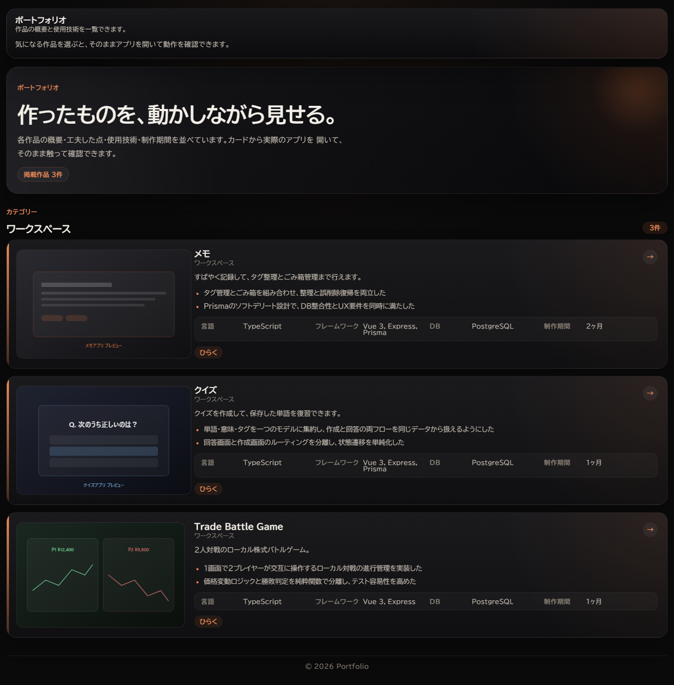
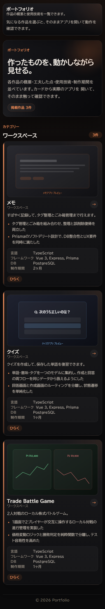

# Memo App

Vue 3 / Express / Prisma / PostgreSQL で組んだフルスタックのメモアプリ（個人制作）。feature 単位のクリーンアーキテクチャと、CI で自動検証する層間依存ルールが特徴。

> **🚀 ライブデモ:** http://3.104.123.11/  
> **📖 アーキテクチャ:** [docs/ARCHITECTURE.md](docs/ARCHITECTURE.md) ／ **🛠 セットアップ:** [docs/LOCAL_SETUP.md](docs/LOCAL_SETUP.md)



<p align="center">
  
</p>

## ハイライト

- **アーキテクチャ境界の自動強制** — 独自の [`tooling/check-architecture.mjs`](tooling/check-architecture.mjs) が CI で層間の不正な import を検査。詳細ルールは [docs/ARCHITECTURE_RULES.md](docs/ARCHITECTURE_RULES.md)
- **feature 単位のクリーンアーキテクチャ** — `application/` / `infrastructure/` / `presentation/` を各 feature 内で分離。application 層は ORM 生成型を一切参照しない
- **push 毎の E2E** — [GitHub Actions](.github/workflows/deploy.yml) で Playwright スモークテスト → EC2 へ自動デプロイ（3 層コンテナのヘルスチェック込み）
- **3 層 Docker スタック** — PostgreSQL 16 / Express API / Nginx frontend を [`docker-compose.yml`](docker-compose.yml) で一発起動
- **型安全な Undo / Redo** — メモ・タグ操作をコマンドパターン + Pinia で履歴管理（`frontend/src/shared/history/`, `useMemoHistoryCommands.ts`）
- **44 件以上のフロントエンド単体テスト** — コンポーネント挙動・store・コマンド・API エラー正規化・Vite プロキシスモークまでカバー

## 技術スタック

| レイヤー | 使用技術 |
|---|---|
| Frontend | Vue 3 (Composition API) / TypeScript (strict) / Vite / Pinia / TailwindCSS / Vitest / Playwright |
| Backend  | Express / TypeScript / Prisma / PostgreSQL 16 / Jest + Supertest |
| DevOps   | Docker Compose / GitHub Actions / AWS EC2 / Nginx |

## 構成

```text
memo-app/
├─ backend/              # Express API（feature × レイヤー分離）
├─ frontend/             # Vue 3 SPA（feature × containers/ui/model 分離）
├─ docs/                 # ARCHITECTURE.md / ARCHITECTURE_RULES.md / screenshots
├─ tooling/              # 共有 TS 設定 + アーキテクチャ境界チェッカー
├─ .github/workflows/    # CI / デプロイパイプライン
├─ docker-compose.yml    # 3 層ローカル / 本番スタック
└─ .env.example          # Docker 用認証情報テンプレート
```

runtime の詳細な流れは [docs/ARCHITECTURE.md](docs/ARCHITECTURE.md) を参照。

## クイックスタート

```powershell
cp .env.example .env
docker compose up --build
```

Node で個別に動かす手順・テスト実行方法は [docs/LOCAL_SETUP.md](docs/LOCAL_SETUP.md)。

## 貢献・コミット規約

[CONTRIBUTING.md](CONTRIBUTING.md) を参照。

## ライセンス

[MIT](LICENSE)
