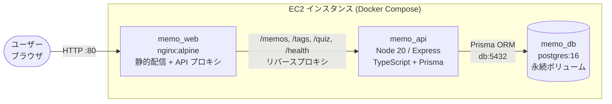
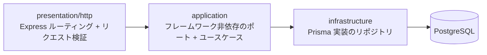
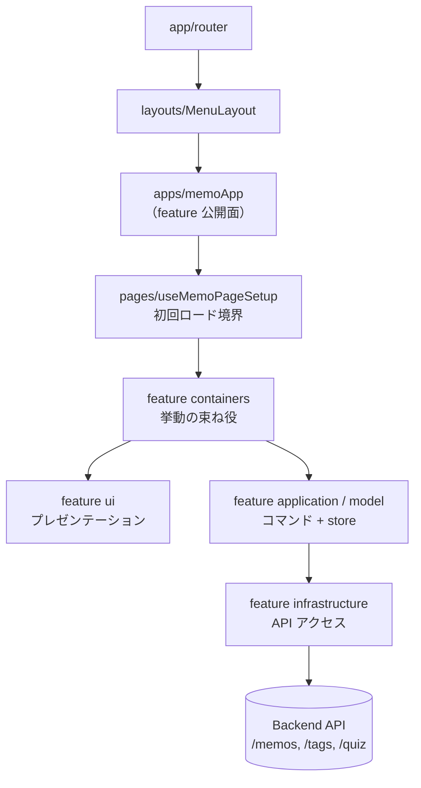

# アーキテクチャ概要

このドキュメントは memo-app の実行時構造と feature 内部の層構成を説明します。  
自動検証される境界ルールは [ARCHITECTURE_RULES.md](./ARCHITECTURE_RULES.md) を、ガード実装は [`tooling/check-architecture.mjs`](../tooling/check-architecture.mjs) を参照してください。

---

## コンテナ構成（3 層）



- **外部公開は web のみ**。API / DB はコンテナ間ネットワークに閉じる。
- API イメージは GitHub Actions がビルドして GHCR に push、EC2 は pull するだけ（[deploy.yml](../.github/workflows/deploy.yml) 参照）。

---

## feature 内部の層方向

各 feature は `presentation/http → application → infrastructure` の一方向依存に統一され、[`tooling/check-architecture.mjs`](../tooling/check-architecture.mjs) が静的に検査しています。



- **application 層は Prisma 生成型を一切 import しない**。ドメインモデルへの変換は infrastructure 層が担う。
- **presentation 層は application の公開関数だけを呼ぶ**。infrastructure は presentation からは見えない。

---

## フロントエンドの合成フロー



- **Application フックはライフサイクルを持たない**。初回ロードは `pages/useMemoPageSetup` か containers に置く。
- **containers が store 読み込み・コマンド実行・確認フローを所有**。presenter コンポーネントはイベントを上へ emit するだけ。

---

## トップレベル

```text
memo-app/
|- .github/
|- backend/
|- docs/
|- frontend/
|- tooling/
|- docker-compose.yml
`- README.md
```

- `backend` — Express API 本体
- `frontend` — Vue 3 アプリケーション本体
- `docs` — アーキテクチャ・運用ドキュメント
- `tooling` — 境界検査スクリプトなどプロジェクト横断の設定
- `.github/workflows/deploy.yml` — validate → build-push (GHCR) → deploy の 3 ジョブ

---

## 実行時構造

### バックエンド

```text
backend/src/
|- app.ts            # エンドポイント (/health, /memos, /tags, /quiz) をマウント
|- server.ts         # HTTP サーバー起動
|- config.ts         # 環境変数ベースの設定
|- db.ts
|- features/
|  |- memo/                       # 参照 feature
|  |  |- application/             # ポート + ユースケースファクトリ
|  |  |- infrastructure/          # Prisma リポジトリ
|  |  |- presentation/http/       # Express ルーティング + リクエストパース
|  |  `- index.ts                 # feature 公開面 (組み立て)
|  `- quiz/                       # 参照 feature（同構成）
|- shared/
|- test/
`- types/
```

- `features/memo` と `features/quiz` が参照 feature。新規 feature はこの構成に揃える。
- `features/*/index.ts` でリポジトリ・ユースケース・ルーターを合成する（組立てのみここで行う）。

### フロントエンド

```text
frontend/src/
|- app/router/       # トップレベルルーター + アプリレジストリ
|- apps/
|  |- memoApp/                    # 参照 app
|  |  |- features/
|  |  |  |- memo/                 # メモ一覧・作成・履歴
|  |  |  |- tag/                  # タグ選択・編集
|  |  |  `- view/                 # メモ表示スコープ
|  |  |- pages/                   # ページ境界（useMemoPageSetup 等）
|  |  |- styles/
|  |  |- routes.ts
|  |  `- index.ts                 # app 公開面
|  |- quiz-app/                   # 参照 app（同構成）
|  |- testApp/
|  `- tradeApp/
|- layouts/          # MenuLayout 等のシェル
|- pages/menu/       # メニューホーム
|- shared/           # API クライアント / feedback / theme / keyboard 等
|- styles/
`- test/
```

- `apps/memoApp/features/tag` は `containers/` / `ui/` / `model/` / `application/` / `infrastructure/` / `types.ts` に分離し、feature 公開面は `types.ts` に集約。
- `apps/quiz-app/features/quiz` も同じく層分離済み。初回ロードは containers に、application フックはライフサイクル非依存で統一。
- `tradeApp` / `testApp` は参照スコープ外。段階的に同じ feature 構成へ移行する計画。

---

## Source Of Truth

- 実行エントリポイント
  - [`backend/src/app.ts`](../backend/src/app.ts)
  - [`frontend/src/app/router/index.ts`](../frontend/src/app/router/index.ts)
- 境界ルール（人間が読む）
  - [`docs/ARCHITECTURE_RULES.md`](./ARCHITECTURE_RULES.md)
- ガード実装（CI で走る）
  - [`tooling/check-architecture.mjs`](../tooling/check-architecture.mjs)
- デプロイパイプライン
  - [`.github/workflows/deploy.yml`](../.github/workflows/deploy.yml)
